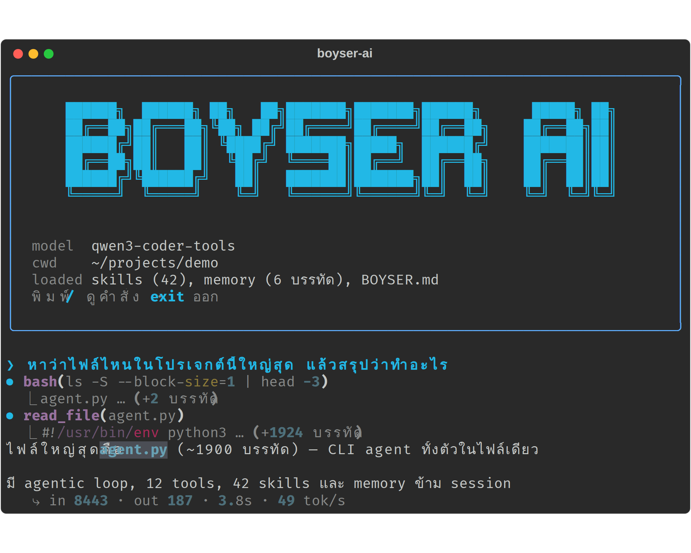

# ✻ BOYSER AI

CLI coding agent สไตล์ Claude Code — รันบนเครื่องตัวเอง ใช้ได้ทั้ง **Claude API**, **Cloud API** (OpenRouter / Groq / DeepSeek / OpenAI / Together / Gemini) และ**โมเดล local ฟรี** (Ollama / llama.cpp)



ทั้งโปรเจกต์อยู่ในไฟล์เดียว `agent.py` (~1900 บรรทัด) — อ่านง่าย แก้ง่าย

## ฟีเจอร์

- **Agentic loop** — โมเดลเรียก tools วนจนงานเสร็จ: `bash` `read_file` `write_file` `edit_file` `glob` `grep` `web_search` `web_fetch` `todo_write` `remember` `use_skill` `ask_user`
- **42 skills** ติดมาให้ (code-review, debug, tdd, web-research, sql, regex, git-commit ฯลฯ) — โหลดแบบ progressive disclosure ประหยัด context
- **Memory ข้าม session** + auto-load ไฟล์โปรเจกต์ (`BOYSER.md`/`AGENTS.md`/`CLAUDE.md`)
- **UI แบบ Claude Code** — กล่องพิมพ์มีกรอบ, slash menu (`/`), 6 ธีมสี, shimmer spinner, ESC หยุดกลางคัน
- **`/save`** — ให้โมเดลที่ขับ tool ไม่เก่ง (เช่น gemma) ออกหลายไฟล์เป็นข้อความ แล้วแยกเขียนลงดิสก์ทีเดียว
- **`/think`** — เปิดโหมดคิดก่อนตอบสำหรับโมเดล local ที่รองรับ
- รองรับ tool-call ที่โมเดล local พ่นเป็นข้อความ (fallback parser 3 ฟอร์แมต)

## ติดตั้ง

ต้องมี Python 3.10+

```bash
git clone https://github.com/apgamerinfo/boyser-ai.git
cd boyser-ai
sh install.sh
boyser-ai          # ครั้งแรกจะมี wizard เลือก backend/โมเดล
```

**Windows:** รัน `install.bat` แทน `sh install.sh` (ที่เหลือเหมือนกัน — ติดตั้งเสร็จให้เปิดเทอร์มินัลใหม่ก่อนใช้ครั้งแรก)
แนะนำให้ลง [Git for Windows](https://git-scm.com/download/win) ด้วย — tool `bash` จะใช้ Git Bash อัตโนมัติ (คำสั่ง bash ที่โมเดลเขียนใช้ได้เลย) ถ้าไม่มีจะ fallback เป็น cmd.exe

ใช้โมเดล local ฟรี: ติดตั้ง [Ollama](https://ollama.com) แล้ว `ollama pull qwen3-coder` (หรือโมเดลอื่นที่รองรับ tools)

### ใช้ GPU เครื่องอื่นในวง LAN

มีเครื่องแรงอยู่เครื่องเดียว? ให้เครื่องนั้นเปิด Ollama รับ LAN:

```bash
sudo sh -c 'mkdir -p /etc/systemd/system/ollama.service.d && printf "[Service]\nEnvironment=\"OLLAMA_HOST=0.0.0.0\"\n" > /etc/systemd/system/ollama.service.d/lan.conf && systemctl daemon-reload && systemctl restart ollama'
```

แล้วเครื่องอื่นชี้ไปหา: ตอน wizard เลือก Ollama ใส่ IP เครื่องนั้น (เช่น `192.168.1.10`) หรือสั่งตรง

```bash
boyser-ai --local http://192.168.1.10:11434/v1 --model qwen3-coder
```

⚠️ เปิดแล้วทุกเครื่องในวง LAN เรียกโมเดลได้โดยไม่มีรหัสผ่าน — ใช้เฉพาะวงที่ไว้ใจได้

## ใช้งาน

```bash
boyser-ai                                   # ใช้ config ที่เซฟไว้
boyser-ai --setup                           # เปิด wizard ตั้งค่าใหม่
boyser-ai --local --model qwen3-coder       # บังคับ local ชั่วคราว
boyser-ai --yolo                            # ไม่ถามยืนยัน tool
```

ใน REPL: พิมพ์ `/` ดูเมนูคำสั่ง (`/help /clear /model /ctx /theme /skills /memory /save /tools /status /statusline /think /update /yolo /exit`) · `exit` ออก

มีเวอร์ชันใหม่บน GitHub เมื่อไหร่ โปรแกรมจะแจ้งเตือนตอนเปิด — พิมพ์ `/update` เพื่ออัปเดตได้เลย

ตั้งค่าเก็บที่ `~/.config/boyser-ai/` (config.json, memory.md, skills/, history)

## เพิ่ม skill เอง

สร้างโฟลเดอร์ที่มี `SKILL.md` (frontmatter `name`/`description`) วางที่ `./.boyser/skills/<ชื่อ>/` (เฉพาะโปรเจกต์) หรือ `~/.config/boyser-ai/skills/<ชื่อ>/` (ทุกที่)

## License

MIT
